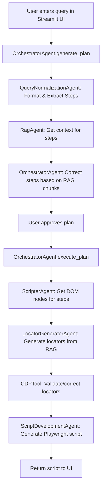
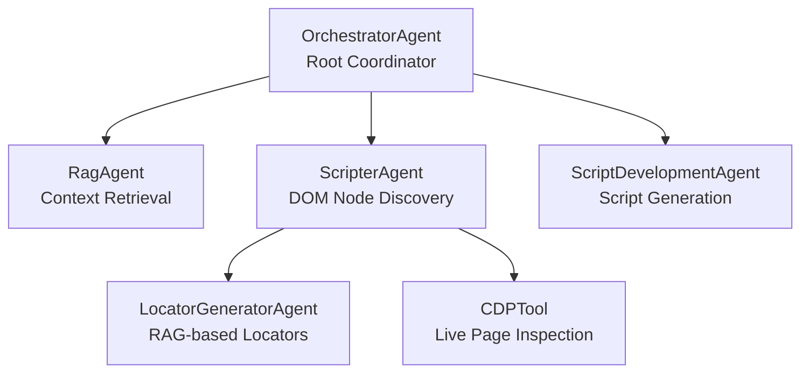
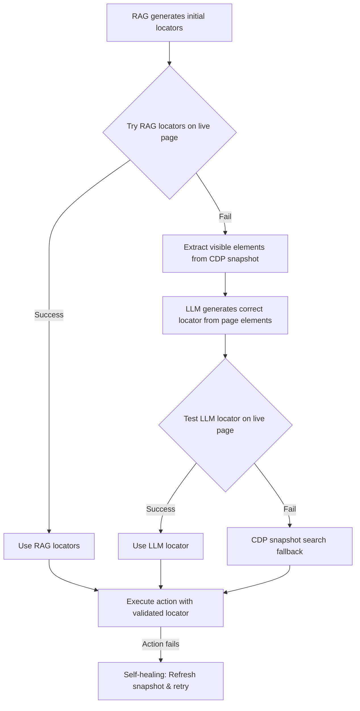

# REFRAG System Flow Documentation

## Table of Contents
1. [Flow from Streamlit UI to Script Generation](#1-flow-from-streamlit-ui-to-script-generation)
2. [Agent Architecture & Prompts](#2-agent-architecture--prompts)
3. [Tool Usage in End-to-End Process](#3-tool-usage-in-end-to-end-process)
4. [CDP's Role in Finalizing Script Locators](#4-cdps-role-in-finalizing-script-locators)
5. [Example: Information & JSON Exchanges](#5-example-information--json-exchanges)

---

## 1. Flow from Streamlit UI to Script Generation

### High-Level Flow Diagram



### Detailed Step-by-Step Flow

#### **Phase 1: Planning (generate_plan)**

1. **User Input** → Streamlit UI
   - User enters natural language query (e.g., "Navigate to localhost:3000, click on Contact, enter 'Chetan Chauhan' into Name field")
   - User clicks "Generate Plan" button

2. **OrchestratorAgent.generate_plan()** is called
   - Receives: `user_query`, `rag_pipeline`
   - Returns: Plan dictionary with steps, RAG context, corrections

3. **Step 1: Query Normalization**
   - **Agent**: QueryNormalizationAgent (embedded in OrchestratorAgent)
   - **Method**: `format_request_for_llm(user_query)`
   - **LLM Call**: Gemini with system prompt for query normalization
   - **Output**: 
     ```json
     {
       "formatted_request": "Navigate to localhost:3000, click on the 'Contact' link, enter 'Chetan Chauhan' into the 'Name' field",
       "steps": [
         "Navigate to localhost:3000",
         "Click on the 'Contact' link",
         "Enter 'Chetan Chauhan' into the 'Name' field"
       ],
       "intent": "Automate contact form filling workflow"
     }
     ```

4. **Step 2: RAG Context Retrieval**
   - **Agent**: RagAgent
   - **Method**: `get_context_for_steps(user_request, steps, formatted_request)`
   - **Process**:
     - Queries RAG pipeline for overall context (using formatted_request)
     - Queries RAG pipeline for each step individually (top_k=20 per step)
   - **Output**:
     ```json
     {
       "overall_context": {
         "answer": "LLM-generated summary of relevant docs",
         "retrieved": [/* 40 chunks */]
       },
       "step_contexts": {
         "step_1": {
           "step": "Navigate to localhost:3000",
           "context": {/* RAG result */},
           "retrieved_chunks": [/* 20 chunks */],
           "answer": "..."
         },
         "step_2": { /* ... */ },
         "step_3": { /* ... */ }
       },
       "steps": [/* original steps */],
       "user_request": "..."
     }
     ```

5. **Step 2.5: Step Correction Based on RAG Chunks**
   - **Agent**: OrchestratorAgent
   - **Method**: `correct_steps_based_on_chunks(steps, rag_result)`
   - **Process**:
     - For each step, analyzes retrieved chunks
     - Uses LLM to correct terminology (e.g., "Users" → "User", "Save" → "Post")
     - Extracts available options from chunks if exact match not found
     - **GUARD**: Protects steps with keywords like "Contact", "Post", "Click on", "Enter"
   - **LLM Prompt**: Step Correction Agent prompt (see section 2)
   - **Output**:
     ```json
     {
       "corrected_steps": [
         "Navigate to localhost:3000",
         "Click on Contact",  // Corrected from "Click on the 'Contact' link"
         "Enter 'Chetan Chauhan' into the 'Name' field"
       ],
       "step_corrections": {
         "2": {
           "original": "Click on the 'Contact' link",
           "corrected": "Click on Contact",
           "referenced_chunks": [/* chunks that influenced correction */]
         }
       }
     }
     ```

6. **Plan Returned to UI**
   - User reviews plan in Streamlit
   - Can approve or reject

#### **Phase 2: Execution (execute_plan)**

7. **User Approves Plan** → `execute_plan()` is called

8. **Step 3: DOM Node Discovery**
   - **Agent**: ScripterAgent
   - **Method**: `get_nodes_for_steps(steps, context)`
   - **Sub-process**:
     
     **3a. Generate Initial Locators from RAG**
     - **Agent**: LocatorGeneratorAgent
     - **Method**: `generate_locators_for_steps(steps, context)`
     - **Process**: Uses RAG chunks to infer locators (IDs, names, classes, etc.)
     - **Output**: Initial locator strategies for each step
     
     **3b. Start CDP Session**
     - **Tool**: CDPTool
     - **Method**: `start_session(url)`
     - **Process**: Launches Chrome, connects via CDP, inspects page, caches snapshot
     
     **3c. Validate/Correct Locators**
     - For each step:
       - **Try RAG-generated locators** on live page
       - **If they work**: Use them directly, execute action
       - **If they fail**: 
         - Extract visible/interactable elements from CDP snapshot
         - Use LLM to generate correct locator from page elements
         - Validate new locator on live page
         - Execute action
       - **Self-healing**: If action fails, refresh snapshot and retry

9. **Step 4: Script Generation**
   - **Agent**: ScriptDevelopmentAgent
   - **Method**: `generate_script(steps, step_nodes, context, automation_tool)`
   - **LLM Call**: Gemini with comprehensive prompt including:
     - Steps to automate
     - DOM nodes with complete element data (ComprehensiveElementData)
     - Validated locators
     - RAG context
     - Playwright best practices
   - **Output**: Complete Playwright Python script

10. **Script Returned to UI**
    - Displayed in Streamlit
    - User can download or copy

---

## 2. Agent Architecture & Prompts

### Agent Hierarchy



### 2.1 OrchestratorAgent (Root Agent)

**File**: `agents/orchestrator_agent.py`

**Responsibilities**:
- Parse user request
- Format multi-step test scenarios
- Coordinate sub-agent execution
- Handle errors and retries

**Key Methods**:
1. `format_request_for_llm(user_query)` - Query normalization
2. `correct_steps_based_on_chunks(steps, rag_result)` - Step correction
3. `generate_plan(user_query, rag_pipeline)` - Phase 1
4. `execute_plan(plan, automation_tool)` - Phase 2

#### **Prompt 1: Query Normalization Agent**

**Location**: `orchestrator_agent.py` lines 81-203

**System Instruction**:
```
SYSTEM ROLE: QueryNormalizationAgent
PURPOSE: Rewrite user requests and decompose tasks

You are the Query Normalization & Task Decomposition Agent inside a
multi-agent test-automation system.

Your responsibilities:
- Interpret and normalize natural-language user queries
- Rewrite them into a clear, structured, automation-ready specification
- Break the request into atomic, deterministic steps
- Infer the underlying intent
- Produce a strict JSON response that downstream agents can execute
```

**Input Format**:
```
user_query: A user's natural-language request.
Example: "Can you test the login maybe? I think the button is broken or something."
```

**Output Format** (STRICT JSON):
```json
{
  "formatted_request": "A clean rewritten version of the user query, fully explicit and automation-friendly.",
  "steps": [
    "Step 1 as a clear, atomic action",
    "Step 2",
    "Step 3"
  ],
  "intent": "Short sentence describing the overall goal."
}
```

**Key Rules**:
- **PRESERVE user's action verbs** when clear (e.g., "click", "go to", "open")
- **DISTINGUISH** between:
  - URL navigation: "Navigate to http://..." (use "Navigate to")
  - Clicking UI elements: "Click on Contacts" (use "Click" or preserve user's verb)
- Use imperative verbs: "navigate", "click", "enter", "fill", "verify"
- Avoid grouped tasks; split compound actions
- Maintain correct sequence

**Examples**:
- User: "Go to Contacts" → Step: "Click on the 'Contacts' link" (NOT "Navigate to the 'Contacts' page")
- User: "Navigate to http://example.com" → Step: "Navigate to http://example.com"
- User: "Open the settings menu" → Step: "Click on the 'Settings' menu"

#### **Prompt 2: Step Correction Agent**

**Location**: `orchestrator_agent.py` lines 325-396

**System Instruction**:
```
You are an LLM-based Step Correction Agent. Your job is to rewrite automation steps 
so they strictly match terminology from RAG-retrieved chunks. Chunks may contain code, 
documentation, API schemas, configuration files, text files, spreadsheets, or any other 
reference material.

Your output must be a corrected step that uses the exact terminology found in the chunks.
```

**Input**:
```
ORIGINAL_STEP: {step}

RAG_CHUNKS (authoritative source of truth):
{chunks_text}
```

**Correction Logic**:
1. **Singular/Plural** - Match exact form (e.g., "Users" → "User")
2. **Terminology** - Replace generic with domain-specific (e.g., "Submit" → "Publish")
3. **Field Names** - Use exact identifiers (e.g., "Full Name" → "fullName")
4. **UI Labels** - Match exact text (e.g., "Close" → "Dismiss")
5. **Values/Options** - Correct based on chunks (e.g., "Active" → "Enabled")
6. **File/Sheet Names** - Match exact names
7. **Any Other Text** - Excel cells, config values, JSON paths, etc.

**Output Requirements**:
- Return **ONLY** the corrected step
- No commentary, no explanation, no markdown
- Maintain the action verb (click, type, select, open, navigate, etc.)
- Use only terminology that appears in the RAG chunks

**Examples**:
- "Select Users from dropdown" → "Select User from dropdown"
- "Enter Full Name" → "Enter fullName"
- "Click Submit" → "Click Publish"
- "Select Active status" → "Select Enabled status"

**GUARD Protection**:
Steps containing keywords like "Contact", "Post", "Click on", "Enter" are protected from auto-correction to prevent hallucination.

---

### 2.2 RagAgent

**File**: `agents/rag_agent.py`

**Responsibilities**:
- Query RAG system for domain knowledge
- Build context for all test steps
- Return precise, relevant context

**Key Method**:
```python
def get_context_for_steps(user_request: str, steps: List[str], formatted_request: Optional[str] = None) -> Dict[str, Any]
```

**Process**:
1. Query RAG for overall context (using formatted_request, top_k=40)
2. Query RAG for each step individually (top_k=20 per step)
3. Return structured context with chunks

**No LLM Prompts** - This agent only queries the RAG pipeline

---

### 2.3 ScripterAgent

**File**: `agents/scripter_agent.py`

**Responsibilities**:
- Execute each step using CDP Inspector
- Use CDP tool to inspect pages and find DOM nodes
- Collect relevant DOM nodes for each step
- Return step-to-node mapping

**Key Method**:
```python
def get_nodes_for_steps(steps: List[str], context: Dict[str, Any]) -> Dict[str, Any]
```

**Process**:
1. Generate initial locators from RAG context (via LocatorGeneratorAgent)
2. Start CDP session (via CDPTool)
3. For each step:
   - Try RAG-generated locators
   - If they fail, use LLM to generate correct locator from page elements
   - Validate locators on live page
   - Execute action
   - Self-heal if action fails
4. Return nodes with validated locators

**No Direct LLM Prompts** - Delegates to LocatorGeneratorAgent and CDPTool

---

### 2.4 LocatorGeneratorAgent

**File**: `agents/locator_generator_agent.py`

**Responsibilities**:
- Generate locators from RAG context
- Infer DOM element properties from documentation
- Return locator strategies

**Key Method**:
```python
def generate_locators_for_steps(steps: List[str], context: Dict[str, Any]) -> Dict[str, List[Dict]]
```

**LLM Prompt**: Locator Generation from RAG Context

**System Instruction**:
```
You are a Locator Generation Agent. Your job is to generate robust, stable locators 
for web elements based on RAG-retrieved documentation, code, and context.

Given a step and relevant code/documentation chunks, infer the best locators for the 
target element.
```

**Input**:
```
STEP: {step}

RAG_CHUNKS:
{chunks_text}
```

**Output** (JSON):
```json
[
  {
    "type": "id",
    "selector": "#contact-link",
    "confidence": 0.9,
    "stability": "high",
    "reasoning": "Found id='contact-link' in navigation.tsx"
  },
  {
    "type": "attribute",
    "selector": "[data-testid='contact-nav']",
    "confidence": 0.95,
    "stability": "high",
    "reasoning": "Found data-testid in test file"
  }
]
```

**Locator Priority**:
1. `data-testid`, `data-test`, `data-cy` (highest stability)
2. `id` (if not dynamic)
3. `name`
4. `aria-label`
5. `role` + accessible name
6. `class` (if stable, not hashed)
7. `xpath` (lowest priority, brittle)

---

### 2.5 ScriptDevelopmentAgent

**File**: `agents/script_dev_agent.py`

**Responsibilities**:
- Generate automation script using LLM
- Use context + nodes + steps
- Format and deliver final script

**Key Method**:
```python
def generate_script(steps: List[str], step_nodes: Dict[str, Any], context: Dict[str, Any], automation_tool: str = "playwright") -> str
```

#### **Prompt 3: Script Generation Agent**

**Location**: `script_dev_agent.py` lines 73-163

**System Instruction**:
```
Generate a complete {automation_tool} automation script based on the following requirements.

USER REQUEST: {context.get('user_request', '')}

STEPS TO AUTOMATE:
1. {step_1}
2. {step_2}
...

RELEVANT DOM NODES FOR EACH STEP:
{formatted_nodes_with_complete_element_data}

CONTEXT FROM DOCUMENTATION:
{context_text}
```

**CRITICAL REQUIREMENTS - PLAYWRIGHT BEST PRACTICES**:

1. **USE SEMANTIC LOCATORS ONLY**
   - `getByRole()` - For buttons, links, textboxes with accessible roles
   - `getByText()` - For elements with visible text
   - `getByLabel()` - For form inputs with labels
   - `getByPlaceholder()` - For inputs with placeholder text
   - `getByTestId()` - For elements with data-testid

2. **MAPPING NODE DATA TO SEMANTIC LOCATORS**:
   - If node has `role` → use `get_by_role(role, name=text_or_label)`
   - If node has visible text → use `get_by_text(text)`
   - If node has `aria-label` → use `get_by_role(role, name=aria_label)`
   - If node has `placeholder` → use `get_by_placeholder(placeholder)`
   - If node has label → use `get_by_label(label_text)`
   - If node has `data-testid` → use `get_by_test_id(testid)`

3. **EXAMPLES - CORRECT USAGE**:
   ```python
   # For a link with text "Contact":
   await page.get_by_role("link", name="Contact").click()
   # OR
   await page.get_by_text("Contact").click()
   
   # For a button with text "Post":
   await page.get_by_role("button", name="Post").click()
   
   # For an input with placeholder "Enter your name":
   await page.get_by_placeholder("Enter your name").fill("John Doe")
   
   # For an input with label "Email":
   await page.get_by_label("Email").fill("test@example.com")
   ```

4. **FALLBACK TO LOCATOR ONLY IF**:
   - The "Best Locator" is a CSS selector or XPath that cannot be converted
   - Use exact locator provided:
     - XPath: `page.locator("xpath=//button[@class='submit']")`
     - CSS: `page.locator(".bg-primeColor")`

5. **GENERAL REQUIREMENTS**:
   - Use Playwright Python async API
   - Include proper imports: `from playwright.async_api import async_playwright`
   - Use `async def main()` pattern
   - Include error handling with try/except
   - Add print statements after each action
   - For navigation: `await page.goto("url")`
   - Match exact terminology from documentation

**Output**: Complete Python script (no explanations)

---

## 3. Tool Usage in End-to-End Process

### 3.1 RAG Tool (rag_tool.py)

**Purpose**: Query the RAG system for context

**Usage in Flow**:
- **When**: Phase 1 (Planning) - Step 2
- **Called by**: RagAgent
- **Method**: `query(query_text, top_k, use_iterative)`

**Process**:
1. Receives query text
2. Queries RAG pipeline (FAISS index + LLM)
3. Returns retrieved chunks + LLM-generated answer

**Example Call**:
```python
# Overall context
overall_result = rag_tool.query("Navigate to localhost:3000, click Contact, enter name", top_k=40)

# Step-specific context
step_result = rag_tool.query("Click on Contact", top_k=20)
```

**Example Output**:
```json
{
  "answer": "The Contact link is located in the navigation bar with id='contact-link' and data-testid='contact-nav'",
  "retrieved": [
    {
      "path": "src/components/Navigation.tsx",
      "text": "<a id='contact-link' data-testid='contact-nav' href='/contact'>Contact</a>",
      "score": 0.95
    },
    // ... more chunks
  ]
}
```

---

### 3.2 CDP Tool (cdp_tool.py)

**Purpose**: Inspect live web pages using Chrome DevTools Protocol

**Key Classes**:
1. **CDPInspector** - Low-level CDP communication
2. **CDPTool** - High-level interface for finding DOM nodes

#### **CDPInspector**

**Methods**:
- `launch_chrome()` - Launch Chrome with remote debugging
- `connect()` - Connect to Chrome via CDP
- `inspect(url)` - Inspect URL and return DOM snapshot
- `_traverse(node, parent_id, parent_path)` - Recursively traverse DOM
- `_process_node(node, parent_id, node_path)` - Extract ComprehensiveElementData

**ComprehensiveElementData Structure**:
```python
@dataclass
class ComprehensiveElementData:
    nodeId: int
    backendNodeId: int
    nodeType: int
    nodeName: str
    localName: str
    nodeValue: str
    parentId: Optional[int]
    nodePath: str  # XPath
    attributes: Dict[str, str]  # All HTML attributes
    isVisible: bool
    isInteractable: bool
    locators: List[LocatorStrategy]
    computedStyle: Dict[str, str]  # CSS computed styles
    boxModel: Optional[Dict]  # Bounding box
    eventListeners: List[str]
    frameworkHints: FrameworkHints  # React/Angular/Vue
    runtime: Dict[str, Any]  # textContent, etc.
```

#### **CDPTool**

**Usage in Flow**:
- **When**: Phase 2 (Execution) - Step 3
- **Called by**: ScripterAgent

**Key Methods**:

1. **`start_session(url)`** - Start persistent CDP session
   ```python
   session_started = cdp_tool.start_session("http://localhost:3000")
   # Launches Chrome, navigates to URL, caches snapshot
   ```

2. **`find_relevant_node(step, context, url, validate_locators, use_session)`**
   - Find DOM node for a step
   - Validate locators on live page
   - Return ComprehensiveElementData + validated locators

3. **`find_node_by_locators(rag_locators, step, snapshot)`**
   - Try RAG-generated locators on snapshot
   - Return node if found, None otherwise

4. **`generate_locator_with_llm(step, failed_rag_locators, visible_elements, url)`**
   - **LLM Prompt**: Generate correct locator from page elements
   - Called when RAG locators fail

5. **`execute_action(locator, step)`**
   - Execute action (click, fill, etc.) using CDP
   - Return success/failure result

6. **`_validate_locators(locators, url)`**
   - Test each locator on live page
   - Mark as validated if found

7. **`_test_locator(selector, locator_type)`**
   - Test single locator on live page
   - Return True if element found

8. **`close_session()`** - Close CDP session

#### **LLM Prompt: Generate Locator from Page Elements**

**Location**: `cdp_tool.py` (method `generate_locator_with_llm`)

**System Instruction**:
```
You are a Locator Generation Agent. Your job is to generate the BEST locator for a 
web element based on:
1. The step description
2. Failed RAG-generated locators (for reference)
3. Visible and interactable elements on the page

Given the step and available page elements, select the BEST element and generate the 
BEST locator for it.
```

**Input**:
```
STEP: {step}

FAILED RAG LOCATORS (for reference):
{failed_rag_locators}

VISIBLE & INTERACTABLE ELEMENTS ON PAGE:
{visible_elements}
```

**Output** (JSON):
```json
{
  "type": "attribute",
  "selector": "[data-testid='contact-nav']",
  "confidence": 0.95,
  "stability": "high",
  "reasoning": "Element with text 'Contact' found with stable data-testid attribute"
}
```

**Locator Selection Priority**:
1. `data-testid`, `data-test`, `data-cy` (highest)
2. `id` (if not dynamic/hashed)
3. `name`
4. `aria-label`
5. `role` + text
6. `text content` (for links/buttons)
7. `class` (if stable)
8. `xpath` (last resort)

---

## 4. CDP's Role in Finalizing Script Locators

### 4.1 The Locator Validation Pipeline



### 4.2 How CDP Helps Finalize Locators

#### **Step 1: RAG Locator Generation**

**Source**: LocatorGeneratorAgent analyzes RAG chunks

**Example RAG Chunks**:
```typescript
// src/components/Navigation.tsx
<a id="contact-link" data-testid="contact-nav" href="/contact">
  Contact
</a>
```

**Generated Locators**:
```json
[
  {
    "type": "id",
    "selector": "#contact-link",
    "confidence": 0.9,
    "stability": "high"
  },
  {
    "type": "attribute",
    "selector": "[data-testid='contact-nav']",
    "confidence": 0.95,
    "stability": "high"
  }
]
```

#### **Step 2: CDP Validation (CRITICAL)**

**Process**:
1. CDP inspects live page → DOM snapshot with 1000+ nodes
2. For each RAG locator:
   - Try to find element using `_test_locator(selector, type)`
   - If found → Mark as `validated: true`
   - If not found → Mark as `validated: false`

**Example**:
```python
# Test locator on live page
locator_works = cdp_tool._test_locator("#contact-link", "id")
# Returns: True (element found on page)
```

**Result**:
```json
[
  {
    "type": "id",
    "selector": "#contact-link",
    "confidence": 0.9,
    "stability": "high",
    "validated": true,  // ✅ CDP confirmed
    "validation_message": "✅ Found node on page"
  }
]
```

#### **Step 3: Locator Correction (If RAG Fails)**

**Scenario**: RAG locators don't work on live page

**CDP's Role**:
1. **Extract visible elements** from snapshot:
   ```python
   visible_elements = cdp_tool.extract_visible_interactable_elements(snapshot)
   # Returns: [
   #   {
   #     "tagName": "A",
   #     "attributes": {"id": "contact-link", "data-testid": "contact-nav"},
   #     "textContent": "Contact",
   #     "isVisible": true,
   #     "isInteractable": true
   #   },
   #   // ... more elements
   # ]
   ```

2. **LLM generates correct locator** from page elements:
   ```python
   llm_locator = cdp_tool.generate_locator_with_llm(
       step="Click on Contact",
       failed_rag_locators=[...],
       visible_elements=visible_elements,
       url="http://localhost:3000"
   )
   ```

3. **CDP validates LLM locator**:
   ```python
   locator_works = cdp_tool._test_locator(
       llm_locator['selector'],
       llm_locator['type']
   )
   # Returns: True (validated on live page)
   ```

**Result**:
```json
{
  "type": "attribute",
  "selector": "[data-testid='contact-nav']",
  "confidence": 0.95,
  "stability": "high",
  "validated": true,  // ✅ CDP confirmed
  "reasoning": "Element with text 'Contact' found with stable data-testid"
}
```

#### **Step 4: Action Execution**

**CDP executes action** using validated locator:
```python
action_result = cdp_tool.execute_action(best_locator, step)
# Uses CDP Input domain to click element
```

**Result**:
```json
{
  "success": true,
  "action": "click",
  "message": "Clicked element successfully",
  "locator": "[data-testid='contact-nav']"
}
```

#### **Step 5: Self-Healing (If Action Fails)**

**Process**:
1. Refresh CDP snapshot
2. Re-verify locator on new snapshot
3. Retry action
4. Report success/failure

### 4.3 Why CDP is Critical

**Without CDP**:
- ❌ Locators are guessed from documentation
- ❌ No validation against live page
- ❌ High failure rate (locators may not exist)
- ❌ No way to correct wrong locators

**With CDP**:
- ✅ Locators validated on live page
- ✅ Incorrect locators detected and corrected
- ✅ Complete element data available (attributes, styles, text)
- ✅ Actions executed and verified
- ✅ Self-healing when page changes

---

## 5. Example: Information & JSON Exchanges

### Example User Request

**User Input**:
```
Navigate to localhost:3000, click on Contact, enter 'Chetan Chauhan' into the Name field
```

### 5.1 Streamlit UI → OrchestratorAgent

**Request**:
```python
plan = orchestrator.generate_plan(
    user_query="Navigate to localhost:3000, click on Contact, enter 'Chetan Chauhan' into the Name field",
    rag_pipeline=pipeline
)
```

---

### 5.2 OrchestratorAgent → LLM (Query Normalization)

**LLM Request**:
```json
{
  "model": "gemini-2.0-flash-exp",
  "contents": [
    "# SYSTEM ROLE: QueryNormalizationAgent\n...\n\nOriginal Query: Navigate to localhost:3000, click on Contact, enter 'Chetan Chauhan' into the Name field"
  ],
  "config": {
    "temperature": 0.3,
    "max_output_tokens": 1024
  }
}
```

**LLM Response**:
```json
{
  "formatted_request": "Navigate to http://localhost:3000, click on the 'Contact' link, enter 'Chetan Chauhan' into the 'Name' field",
  "steps": [
    "Navigate to http://localhost:3000",
    "Click on the 'Contact' link",
    "Enter 'Chetan Chauhan' into the 'Name' field"
  ],
  "intent": "Automate contact form navigation and data entry"
}
```

---

### 5.3 OrchestratorAgent → RagAgent

**Request**:
```python
rag_result = rag_agent.get_context_for_steps(
    user_request="Navigate to localhost:3000, click on Contact, enter 'Chetan Chauhan' into the Name field",
    steps=[
        "Navigate to http://localhost:3000",
        "Click on the 'Contact' link",
        "Enter 'Chetan Chauhan' into the 'Name' field"
    ],
    formatted_request="Navigate to http://localhost:3000, click on the 'Contact' link, enter 'Chetan Chauhan' into the 'Name' field"
)
```

---

### 5.4 RagAgent → RAG Pipeline

**Query 1: Overall Context**
```python
overall_result = rag_pipeline.query(
    "Navigate to http://localhost:3000, click on the 'Contact' link, enter 'Chetan Chauhan' into the 'Name' field",
    top_k=40
)
```

**Response**:
```json
{
  "answer": "The application has a navigation bar with a Contact link (id='contact-link', data-testid='contact-nav'). The contact form has a Name field with id='name-input' and placeholder 'Enter your name'.",
  "retrieved": [
    {
      "path": "src/components/Navigation.tsx",
      "text": "<a id='contact-link' data-testid='contact-nav' href='/contact'>Contact</a>",
      "score": 0.95,
      "chunk_id": "chunk_123"
    },
    {
      "path": "src/components/ContactForm.tsx",
      "text": "<input id='name-input' name='name' placeholder='Enter your name' />",
      "score": 0.92,
      "chunk_id": "chunk_456"
    },
    // ... 38 more chunks
  ]
}
```

**Query 2: Step-Specific Context (Step 2)**
```python
step_result = rag_pipeline.query("Click on the 'Contact' link", top_k=20)
```

**Response**:
```json
{
  "answer": "The Contact link is in the navigation bar with id='contact-link' and data-testid='contact-nav'",
  "retrieved": [
    {
      "path": "src/components/Navigation.tsx",
      "text": "<a id='contact-link' data-testid='contact-nav' href='/contact'>Contact</a>",
      "score": 0.98
    },
    {
      "path": "src/tests/navigation.test.tsx",
      "text": "await page.getByTestId('contact-nav').click();",
      "score": 0.94
    },
    // ... 18 more chunks
  ]
}
```

---

### 5.5 OrchestratorAgent → LLM (Step Correction)

**LLM Request** (for Step 2):
```json
{
  "model": "gemini-2.0-flash-exp",
  "contents": [
    "You are an LLM-based Step Correction Agent...\n\nORIGINAL_STEP:\nClick on the 'Contact' link\n\nRAG_CHUNKS:\n## src/components/Navigation.tsx\n```\n<a id='contact-link' data-testid='contact-nav' href='/contact'>Contact</a>\n```\n\n## src/tests/navigation.test.tsx\n```\nawait page.getByTestId('contact-nav').click();\n```"
  ],
  "config": {
    "temperature": 0.1,
    "max_output_tokens": 256
  }
}
```

**LLM Response**:
```
Click on Contact
```

**Correction Applied**:
```json
{
  "original": "Click on the 'Contact' link",
  "corrected": "Click on Contact",
  "referenced_chunks": [
    {
      "path": "src/components/Navigation.tsx",
      "snippet": "<a id='contact-link' data-testid='contact-nav' href='/contact'>Contact</a>",
      "matched_terms": ["contact"]
    }
  ]
}
```

**GUARD Protection**: Step contains "Contact" keyword, so correction is REVERTED to original:
```json
{
  "final_step": "Click on the 'Contact' link",  // Original preserved
  "correction_reverted": true,
  "reason": "Protected keyword 'Contact' found"
}
```

---

### 5.6 OrchestratorAgent → User (Plan)

**Plan Returned**:
```json
{
  "user_query": "Navigate to localhost:3000, click on Contact, enter 'Chetan Chauhan' into the Name field",
  "formatted_request": {
    "formatted_request": "Navigate to http://localhost:3000, click on the 'Contact' link, enter 'Chetan Chauhan' into the 'Name' field",
    "steps": [
      "Navigate to http://localhost:3000",
      "Click on the 'Contact' link",
      "Enter 'Chetan Chauhan' into the 'Name' field"
    ],
    "intent": "Automate contact form navigation and data entry"
  },
  "steps": [
    "Navigate to http://localhost:3000",
    "Click on the 'Contact' link",
    "Enter 'Chetan Chauhan' into the 'Name' field"
  ],
  "rag_result": {
    "overall_context": { /* ... */ },
    "step_contexts": { /* ... */ }
  },
  "step_corrections": {
    "2": {
      "original": "Click on the 'Contact' link",
      "corrected": "Click on the 'Contact' link",
      "referenced_chunks": []
    }
  }
}
```

---

### 5.7 User Approves → OrchestratorAgent.execute_plan()

**Request**:
```python
result = orchestrator.execute_plan(
    plan=plan,
    automation_tool="playwright"
)
```

---

### 5.8 OrchestratorAgent → ScripterAgent

**Request**:
```python
scripter_result = scripter_agent.get_nodes_for_steps(
    steps=[
        "Navigate to http://localhost:3000",
        "Click on the 'Contact' link",
        "Enter 'Chetan Chauhan' into the 'Name' field"
    ],
    context=rag_result
)
```

---

### 5.9 ScripterAgent → LocatorGeneratorAgent

**Request**:
```python
rag_locators = locator_generator.generate_locators_for_steps(
    steps=[...],
    context=rag_result
)
```

**Response**:
```json
{
  "step_1": [],  // Navigation step, no locators needed
  "step_2": [
    {
      "type": "id",
      "selector": "#contact-link",
      "confidence": 0.9,
      "stability": "high",
      "reasoning": "Found id='contact-link' in Navigation.tsx"
    },
    {
      "type": "attribute",
      "selector": "[data-testid='contact-nav']",
      "confidence": 0.95,
      "stability": "high",
      "reasoning": "Found data-testid in test file"
    }
  ],
  "step_3": [
    {
      "type": "id",
      "selector": "#name-input",
      "confidence": 0.9,
      "stability": "high",
      "reasoning": "Found id='name-input' in ContactForm.tsx"
    },
    {
      "type": "name",
      "selector": "[name='name']",
      "confidence": 0.85,
      "stability": "high",
      "reasoning": "Found name='name' attribute"
    }
  ]
}
```

---

### 5.10 ScripterAgent → CDPTool (Start Session)

**Request**:
```python
session_started = cdp_tool.start_session("http://localhost:3000")
```

**CDP Process**:
1. Launch Chrome with remote debugging
2. Connect to Chrome via CDP
3. Navigate to http://localhost:3000
4. Inspect page → DOM snapshot

**Response**:
```json
{
  "url": "http://localhost:3000",
  "timestamp": "2025-11-25T17:41:22.000Z",
  "nodes": [
    {
      "nodeId": 1,
      "nodeName": "HTML",
      "nodeType": 1,
      // ... 1000+ nodes
    },
    {
      "nodeId": 42,
      "nodeName": "A",
      "localName": "a",
      "attributes": {
        "id": "contact-link",
        "data-testid": "contact-nav",
        "href": "/contact"
      },
      "isVisible": true,
      "isInteractable": true,
      "runtime": {
        "textContent": "Contact"
      },
      "nodePath": "/html/body/nav/a[2]"
    },
    {
      "nodeId": 87,
      "nodeName": "INPUT",
      "localName": "input",
      "attributes": {
        "id": "name-input",
        "name": "name",
        "placeholder": "Enter your name"
      },
      "isVisible": true,
      "isInteractable": true,
      "nodePath": "/html/body/form/input[1]"
    }
  ]
}
```

---

### 5.11 ScripterAgent → CDPTool (Validate RAG Locators - Step 2)

**Request**:
```python
node = cdp_tool.find_node_by_locators(
    rag_locators=[
        {"type": "id", "selector": "#contact-link", "confidence": 0.9},
        {"type": "attribute", "selector": "[data-testid='contact-nav']", "confidence": 0.95}
    ],
    step="Click on the 'Contact' link",
    snapshot=current_snapshot
)
```

**CDP Process**:
1. Try locator 1: `#contact-link`
   - Search snapshot for node with id='contact-link'
   - **Found**: nodeId=42
2. Test on live page:
   ```python
   locator_works = _test_locator("#contact-link", "id")
   # CDP: document.querySelector("#contact-link")
   # Returns: true (element exists)
   ```

**Response**:
```json
{
  "nodeId": 42,
  "nodeName": "A",
  "localName": "a",
  "attributes": {
    "id": "contact-link",
    "data-testid": "contact-nav",
    "href": "/contact"
  },
  "isVisible": true,
  "isInteractable": true,
  "runtime": {
    "textContent": "Contact"
  },
  "nodePath": "/html/body/nav/a[2]",
  "working_locator": {
    "type": "id",
    "selector": "#contact-link",
    "confidence": 0.9,
    "stability": "high",
    "validated": true,
    "validation_message": "✅ Found node on page"
  }
}
```

---

### 5.12 ScripterAgent → CDPTool (Execute Action - Step 2)

**Request**:
```python
action_result = cdp_tool.execute_action(
    locator={
        "type": "id",
        "selector": "#contact-link",
        "validated": true
    },
    step="Click on the 'Contact' link"
)
```

**CDP Process**:
1. Determine action from step: "click"
2. Find element using locator
3. Execute CDP Input.dispatchMouseEvent (click)

**Response**:
```json
{
  "success": true,
  "action": "click",
  "message": "Clicked element successfully",
  "locator": "#contact-link",
  "element": {
    "nodeId": 42,
    "nodeName": "A",
    "textContent": "Contact"
  }
}
```

---

### 5.13 ScripterAgent → OrchestratorAgent (Scripter Result)

**Response**:
```json
{
  "steps": [
    "Navigate to http://localhost:3000",
    "Click on the 'Contact' link",
    "Enter 'Chetan Chauhan' into the 'Name' field"
  ],
  "step_nodes": {
    "step_1": {
      "step": "Navigate to http://localhost:3000",
      "node": {
        "step": "Navigate to http://localhost:3000",
        "source": "navigation",
        "element": null,
        "locators": [],
        "best_locator": null
      },
      "context": { /* RAG context */ }
    },
    "step_2": {
      "step": "Click on the 'Contact' link",
      "node": {
        "step": "Click on the 'Contact' link",
        "element": {
          "nodeId": 42,
          "nodeName": "A",
          "attributes": {
            "id": "contact-link",
            "data-testid": "contact-nav"
          },
          "isVisible": true,
          "isInteractable": true,
          "runtime": {
            "textContent": "Contact"
          }
        },
        "locators": [
          {
            "type": "id",
            "selector": "#contact-link",
            "confidence": 0.9,
            "stability": "high",
            "validated": true
          }
        ],
        "best_locator": {
          "type": "id",
          "selector": "#contact-link",
          "validated": true
        },
        "rag_locators_used": [ /* ... */ ],
        "rag_locators_worked": true,
        "source": "rag_locators_validated",
        "action_result": {
          "success": true,
          "action": "click",
          "message": "Clicked element successfully"
        }
      },
      "context": { /* RAG context */ }
    },
    "step_3": {
      "step": "Enter 'Chetan Chauhan' into the 'Name' field",
      "node": {
        "element": {
          "nodeId": 87,
          "nodeName": "INPUT",
          "attributes": {
            "id": "name-input",
            "name": "name",
            "placeholder": "Enter your name"
          }
        },
        "best_locator": {
          "type": "id",
          "selector": "#name-input",
          "validated": true
        },
        "action_result": {
          "success": true,
          "action": "fill",
          "message": "Filled element with 'Chetan Chauhan'"
        }
      }
    }
  },
  "overall_context": { /* ... */ },
  "url_used": "http://localhost:3000"
}
```

---

### 5.14 OrchestratorAgent → ScriptDevelopmentAgent

**Request**:
```python
generated_script = script_dev_agent.generate_script(
    steps=[
        "Navigate to http://localhost:3000",
        "Click on the 'Contact' link",
        "Enter 'Chetan Chauhan' into the 'Name' field"
    ],
    step_nodes=scripter_result["step_nodes"],
    context=rag_result,
    automation_tool="playwright"
)
```

---

### 5.15 ScriptDevelopmentAgent → LLM (Script Generation)

**LLM Request**:
```json
{
  "model": "gemini-2.0-flash-exp",
  "contents": [
    "Generate a complete playwright automation script...\n\nUSER REQUEST:\nNavigate to localhost:3000, click on Contact, enter 'Chetan Chauhan' into the Name field\n\nSTEPS TO AUTOMATE:\n1. Navigate to http://localhost:3000\n2. Click on the 'Contact' link\n3. Enter 'Chetan Chauhan' into the 'Name' field\n\nRELEVANT DOM NODES FOR EACH STEP:\n\n## step_2: Click on the 'Contact' link\n  Node Name: A\n  Local Name: a\n  Attributes: {\"id\": \"contact-link\", \"data-testid\": \"contact-nav\", \"href\": \"/contact\"}\n  Available Locators:\n    1. [id] #contact-link (confidence: 0.9, stability: high, validated: ✓)\n  Best Locator: [id] #contact-link\n  Text Content: Contact\n\n## step_3: Enter 'Chetan Chauhan' into the 'Name' field\n  Node Name: INPUT\n  Attributes: {\"id\": \"name-input\", \"name\": \"name\", \"placeholder\": \"Enter your name\"}\n  Best Locator: [id] #name-input\n\nCONTEXT FROM DOCUMENTATION:\n...\n\nCRITICAL REQUIREMENTS - PLAYWRIGHT BEST PRACTICES:\n..."
  ],
  "config": {
    "temperature": 0.2,
    "max_output_tokens": 4096
  }
}
```

**LLM Response**:
```python
from playwright.async_api import async_playwright
import asyncio

async def main():
    async with async_playwright() as p:
        browser = await p.chromium.launch(headless=False)
        page = await browser.new_page()
        
        try:
            # Step 1: Navigate to http://localhost:3000
            print("Step 1: Navigating to http://localhost:3000")
            await page.goto("http://localhost:3000")
            print("✓ Navigation successful")
            
            # Step 2: Click on the 'Contact' link
            print("Step 2: Clicking on Contact link")
            await page.locator("#contact-link").click()
            print("✓ Clicked Contact link")
            
            # Step 3: Enter 'Chetan Chauhan' into the 'Name' field
            print("Step 3: Entering name")
            await page.locator("#name-input").fill("Chetan Chauhan")
            print("✓ Entered name: Chetan Chauhan")
            
            print("\n✅ All steps completed successfully!")
            
        except Exception as e:
            print(f"❌ Error: {e}")
        finally:
            await browser.close()

if __name__ == "__main__":
    asyncio.run(main())
```

---

### 5.16 OrchestratorAgent → Streamlit UI (Final Result)

**Response**:
```json
{
  "user_query": "Navigate to localhost:3000, click on Contact, enter 'Chetan Chauhan' into the Name field",
  "formatted_request": {
    "formatted_request": "Navigate to http://localhost:3000, click on the 'Contact' link, enter 'Chetan Chauhan' into the 'Name' field",
    "steps": [ /* ... */ ],
    "intent": "Automate contact form navigation and data entry"
  },
  "steps": [
    "Navigate to http://localhost:3000",
    "Click on the 'Contact' link",
    "Enter 'Chetan Chauhan' into the 'Name' field"
  ],
  "rag_result": { /* ... */ },
  "scripter_result": { /* ... */ },
  "step_corrections": { /* ... */ },
  "generated_script": "from playwright.async_api import async_playwright\n...",
  "automation_tool": "playwright",
  "response": "Generated playwright automation script with 3 steps."
}
```

---

## Summary

### Key Takeaways

1. **Multi-Agent Architecture**: OrchestratorAgent coordinates RagAgent, ScripterAgent, and ScriptDevelopmentAgent

2. **LLM Prompts**:
   - **Query Normalization**: Converts user query to structured steps
   - **Step Correction**: Aligns steps with RAG chunk terminology
   - **Locator Generation**: Generates locators from RAG context
   - **Script Generation**: Creates Playwright script from validated nodes

3. **CDP's Critical Role**:
   - Validates RAG-generated locators on live page
   - Corrects failed locators using LLM + page elements
   - Executes actions and verifies success
   - Self-heals when page changes

4. **Data Flow**:
   - User query → Normalized steps → RAG context → Corrected steps
   - Corrected steps → RAG locators → CDP validation → Validated locators
   - Validated locators + DOM nodes → LLM → Playwright script

5. **JSON Exchanges**:
   - Every agent communicates via structured JSON
   - Complete element data (ComprehensiveElementData) passed through pipeline
   - Locators validated and marked with confidence/stability scores

---

**End of Documentation**
